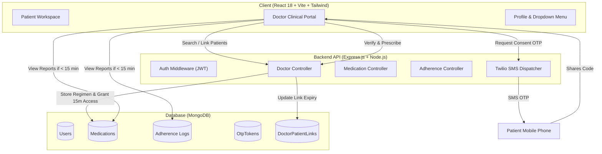

# 🩺 MedSafe — Smart Medication Management, Adherence & Clinical Coordination Platform

> **Healthcare Innovation Platform developed for the Swarnandhra Hackathon**  
> A full-stack solution bridging patients, physicians, and caregivers with verified OTP authorization, adverse interaction prevention, and real-time adherence analytics.

---

## 📋 Table of Contents
1. [Project Overview & Mission](#-project-overview--mission)
2. [Key Highlights & Core Capabilities](#-key-highlights--core-capabilities)
3. [System Architecture & Data Flow](#-system-architecture--data-flow)
4. [Role-Based Feature Breakdown](#-role-based-feature-breakdown)
   - [Patient Workspace](#1-patient-workspace)
   - [Doctor Clinical Portal](#2-doctor-clinical-portal)
   - [Caregiver Network](#3-caregiver-network)
5. [Doctor Workflow & 15-Minute Access Security](#-doctor-workflow--15-minute-access-security)
6. [Adverse Drug-Drug Interaction Safety Engine](#-adverse-drug-drug-interaction-safety-engine)
7. [Database Schema & Models](#-database-schema--models)
8. [Comprehensive API Reference](#-comprehensive-api-reference)
9. [Technology Stack](#-technology-stack)
10. [Environment Variables & Setup Guide](#-environment-variables--setup-guide)
11. [Running Tests & Verification](#-running-tests--verification)
12. [License](#-license)

---

## 🌟 Project Overview & Mission

Medication non-adherence and adverse drug interactions are leading causes of preventable hospitalizations and complications globally. Many patients forget dosages, receive overlapping or conflicting prescriptions from multiple doctors, or alter dosages without verified consent.

**MedSafe** provides an integrated healthcare coordination ecosystem that ensures:
- **Zero Unverified Prescriptions**: Doctors can only prescribe medications upon entering a 6-digit consent OTP sent directly to the patient's phone.
- **Privacy-Protected Clinical Visibility**: Doctors have a strict **15-minute temporary consultation window** to view patient reports and medication regimens, preventing indefinite access to sensitive medical data.
- **Automated Interaction Warning System**: Active prescriptions are continuously scanned against known adverse drug-drug interaction matrices.
- **Closed-Loop Adherence Tracking**: Real-time logging of doses (taken, late, missed, skipped) with compliance score gauges and caregiver alerts.

---

## 🚀 Key Highlights & Core Capabilities

- **🔐 Mobile-First Passwordless Auth**: Instant OTP verification via SMS using Twilio Programmable Messaging with SHA-256 hashed tokens and expiration controls.
- **⏱️ 15-Minute Doctor Report Access Window**: Live countdown timer enforcing time-bound viewing of patient reports. Automatically locks records when the consultation window expires while preserving the patient profile.
- **💊 Patient-Consented E-Prescriptions**: Doctors add or adjust prescriptions only after the patient authorizes the action with a one-time SMS verification code.
- **⚖️ Dosage Titration & Medication Editing**: Quick dosage adjustment with physician reasoning logs, plus full editing of time schedules, frequencies, duration in days, and administration instructions.
- **📊 7 / 14 / 30-Day Clinical Adherence Analytics**: Compliance percentage rating, doses taken vs missed, and printable physician assessment reports.
- **👤 Profile Dropdown & Quick Switching**: Header navigation featuring an interactive profile dropdown with user summary, role tags, portal switching, and safe logout.

---

## 🏗️ System Architecture & Data Flow



---

## 👥 Role-Based Feature Breakdown

### 1. Patient Workspace

- **Daily Adherence Dashboard**:
  - Live compliance progress bar for the current day.
  - Current streak tracking (consecutive days of taking scheduled doses on time).
  - List of today's morning, afternoon, evening, and night doses.
- **Medication Management**:
  - Full inventory of active and archived medications.
  - Detailed dosage info, scheduled hours (e.g. `08:00, 20:00`), food instructions, and refill countdowns.
  - Ability to archive or discontinue medications.
- **Dose Action Logging**:
  - One-click buttons to mark a dose as **Taken**, **Late**, or **Skipped** with clinical reason notes.
- **Safety Alerts**:
  - Real-time warnings if conflicting medications are currently active.
- **Profile & Emergency Contacts**:
  - Full management of blood group, emergency contact name, phone number, and relationship.
  - Inline pencil icon toggle to edit and save details.

---

### 2. Doctor Clinical Portal

- **Patient Search & Roster Management**:
  - Real-time search across the MedSafe database by patient name, phone number, or email.
  - Add existing registered patients to the doctor's clinical roster.
  - Searchable list of connected patients with compliance status pills (e.g. `92% Adherence`, `Active 15m` badge).
- **Patient Profile Header Card**:
  - Always visible when a patient is selected (Name, phone, email, blood group, avatar).
  - Status badge indicating active consultation time remaining or expired status.
- **Prescribe with Patient OTP Consent**:
  - Multi-step modal: Enter drug name, dosage, frequency, administration times, duration in days, and clinical advice.
  - Sends a 6-digit consent code to the patient's mobile phone.
  - Once verified, the prescription is activated and assigned under the patient's record with `prescribedBy: Dr. [Doctor Name]`.
  - Authorizing a prescription automatically grants 15 minutes of access to the patient's reports.
- **Increase / Adjust Dosage**:
  - Quick dosage adjustment dialog (e.g. `5mg` to `10mg`).
  - Physician reason note is automatically timestamped and appended to the prescription's instructions.
- **Edit Medication Details**:
  - Edit schedule times, frequency, duration in days, and active/archived status.
- **Clinical Adherence Analytics & Reporting**:
  - Switch between 7, 14, and 30-day monitoring windows.
  - Metrics: Adherence rate %, total doses scheduled, doses taken, missed, and skipped.
  - Chronological dose log audit table.
  - Print / Export formatted Physician Adherence Assessment Report.

---

### 3. Caregiver Network

- **Family & Caregiver Linking**:
  - Connect caregivers via patient authorization.
  - Caregivers receive notifications if a scheduled dose is missed or skipped.
  - Real-time visibility into medication compliance without altering prescriptions.

---

## ⏱️ Doctor Workflow & 15-Minute Access Security

To prevent unauthorized, open-ended inspection of patient medical histories, MedSafe implements a **strict 15-minute temporary access policy**:

```
+-----------------------------------------------------------------------------------+
|                           15-Minute Access Life Cycle                             |
+-----------------------------------------------------------------------------------+
| 1. Authorization: Doctor requests report access OTP OR prescribes a medication.  |
| 2. Verification:  Patient provides 6-digit OTP received on mobile via SMS.        |
| 3. Access Active: 15-minute window opens (accessExpiresAt = now + 15 mins).       |
|    -> Real-time countdown timer (⏱️ MM:SS remaining) updates every second.       |
|    -> Full medications, adherence history, and reports unlocked.                  |
| 4. Expiration:   When the timer hits 0:00 (or on unauthenticated load):           |
|    -> Backend API returns isAccessExpired: true and withholds reports.            |
|    -> Patient's basic profile card remains visible in "My Patients".             |
|    -> Reports section displays locked notice with 2 direct options:              |
|         a) "View Reports (Verify OTP)" -> Sends new OTP to renew for 15 mins.     |
|         b) "Medicate" -> Prescription flow that automatically renews 15 mins.    |
+-----------------------------------------------------------------------------------+
```

---

## ⚠️ Adverse Drug-Drug Interaction Safety Engine

MedSafe proactively scans active medications for dangerous clinical interactions:

| Drug Combination | Severity | Clinical Warning |
|---|---|---|
| **Aspirin + Warfarin** | 🔴 High | Significantly elevated risk of severe internal bleeding and hemorrhaging. |
| **Lisinopril + Spironolactone** | 🔴 High | Dangerously elevated blood potassium (hyperkalemia) causing cardiac arrhythmias. |
| **Ibuprofen + Lisinopril** | 🟡 Medium | NSAIDs can diminish antihypertensive efficacy and increase nephrotoxicity risk. |
| **Metformin + Furosemide** | 🟡 Medium | Diuretic may alter metformin blood concentrations; increased lactic acidosis risk. |

When conflicting medications are detected, visual warning banners are displayed on both the Patient Dashboard and Doctor Clinical Portal.

---

## 🗄️ Database Schema & Models

### 1. `User` Model
```javascript
{
  phone: { type: String, required: true, unique: true },
  name: { type: String, default: '' },
  email: { type: String, default: '' },
  role: { type: String, enum: ['patient', 'doctor', 'caregiver', 'admin'], default: 'patient' },
  bloodGroup: { type: String, default: '' },
  dateOfBirth: { type: String, default: '' },
  gender: { type: String, default: '' },
  emergencyContact: {
    name: String,
    phone: String,
    relationship: String
  },
  isProfileComplete: { type: Boolean, default: false }
}
```

### 2. `Medication` Model
```javascript
{
  userId: { type: ObjectId, ref: 'User', required: true },
  name: { type: String, required: true },
  dosage: { type: String, default: '' },
  frequency: { type: String, enum: ['once_daily', 'twice_daily', 'thrice_daily', 'four_times_daily', 'weekly', 'as_needed'] },
  times: [{ type: String }],          // e.g. ['08:00', '20:00']
  prescribedBy: { type: String, default: 'Treating Physician' },
  pharmacy: { type: String, default: '' },
  startDate: { type: Date, default: Date.now },
  endDate: { type: Date, default: null },
  durationDays: { type: Number, default: null },
  duration: { type: String, default: '' },
  instructions: { type: String, default: '' },
  refillDate: { type: Date, default: null },
  sideEffects: { type: String, default: '' },
  isActive: { type: Boolean, default: true }
}
```

### 3. `DoctorPatientLink` Model
```javascript
{
  doctorId: { type: ObjectId, ref: 'User', required: true },
  patientId: { type: ObjectId, ref: 'User', required: true },
  status: { type: String, enum: ['active', 'pending'], default: 'active' },
  notes: { type: String, default: '' },
  linkedAt: { type: Date, default: Date.now },
  accessExpiresAt: { type: Date, default: null },    // 15-minute access window
  lastAccessGrantedAt: { type: Date, default: null }
}
// Unique compound index: { doctorId: 1, patientId: 1 }
```

### 4. `OtpToken` Model
```javascript
{
  phone: { type: String, required: true },
  hashedOtp: { type: String, required: true },      // SHA-256 hash
  purpose: { type: String, enum: ['auth', 'medication_consent', 'report_access'], default: 'auth' },
  expiresAt: { type: Date, required: true }         // 5-minute TTL
}
```

### 5. `AdherenceLog` Model
```javascript
{
  userId: { type: ObjectId, ref: 'User', required: true },
  medicationId: { type: ObjectId, ref: 'Medication', required: true },
  scheduledTime: { type: Date, required: true },
  takenTime: { type: Date, default: null },
  status: { type: String, enum: ['taken', 'missed', 'skipped', 'late'], default: 'missed' },
  notes: { type: String, default: '' }
}
```

---

## 📡 Comprehensive API Reference

### Authentication (`/api/auth`)
| Method | Endpoint | Description |
|---|---|---|
| `POST` | `/send-otp` | Sends login/registration OTP to phone number |
| `POST` | `/verify-otp` | Validates OTP and sets secure `httpOnly`, `SameSite=Strict` session cookie |
| `POST` | `/complete-registration` | Creates profile, generates session, and sets secure `httpOnly` cookie |
| `GET` | `/me` | Returns current authenticated user profile via session cookie |
| `PUT` | `/profile` | Updates user demographics, blood group, emergency contact |
| `POST` | `/logout` | Clears `httpOnly` session cookie with `SameSite=Strict` |

### Doctor Portal (`/api/doctor`) *(Requires Authentication)*
| Method | Endpoint | Description |
|---|---|---|
| `GET` | `/search-patients?q=...` | Searches patients across the network by name, phone, or email |
| `POST` | `/add-patient` | Adds an existing patient to doctor's roster |
| `GET` | `/patients` | Fetches doctor's roster with adherence rates & access statuses |
| `POST` | `/patients/:patientId/request-medication-otp` | Sends prescription consent OTP to patient mobile |
| `POST` | `/patients/:patientId/confirm-medication` | Validates OTP, creates prescription, and grants 15-min access |
| `POST` | `/patients/:patientId/request-access-otp` | Sends 15-minute report access verification OTP to patient |
| `POST` | `/patients/:patientId/grant-access` | Validates OTP and grants 15-minute report access window |
| `GET` | `/patients/:patientId/reports?days=7` | Returns reports if access active; returns locked profile if expired |
| `PUT` | `/medications/:medicationId` | Modifies prescription schedule, dosage, frequency, instructions |
| `PATCH`| `/medications/:medicationId/dosage` | Adjusts dosage with physician reason note appended |

### Medications (`/api/medications`) *(Requires Authentication)*
| Method | Endpoint | Description |
|---|---|---|
| `GET` | `/` | Retrieves active and archived medications for logged-in user |
| `POST` | `/` | Creates a new medication regimen entry |
| `PUT` | `/:id` | Updates medication details |
| `DELETE`| `/:id` | Discontinues / deletes a medication |

### Adherence Tracking (`/api/adherence`) *(Requires Authentication)*
| Method | Endpoint | Description |
|---|---|---|
| `GET` | `/today` | Fetches scheduled doses for today |
| `POST` | `/log` | Logs dose status (`taken`, `late`, `skipped`) with notes |
| `GET` | `/stats?days=7` | Returns adherence percentages, streaks, and compliance rating |
| `GET` | `/history` | Chronological adherence history table |

---

## 🛠️ Technology Stack

### Frontend
- **Framework**: React 18 with Vite
- **Styling**: Tailwind CSS
- **State & Routing**: React Context API (`AuthContext`), multi-tab view router
- **Security**: Zero tokens in `localStorage`; authenticated via browser-managed `httpOnly`, `SameSite=Strict` cookies with `credentials: 'include'` on all API calls (XSS exfiltration immune)

### Backend
- **Runtime**: Node.js (ES Modules)
- **Framework**: Express.js with `cookie-parser`
- **Database**: MongoDB with Mongoose ODM
- **SMS Gateway**: Twilio Programmable SMS API (with local sandbox fallback for dev testing)
- **Application-Layer Field-Level Encryption (FLE) at Rest**:
  - **Algorithm**: `AES-256-GCM` authenticated encryption.
  - **Semantic Security (IND-CPA)**: 16-byte cryptographically random IV per write (`crypto.randomBytes(16)`).
  - **Integrity (IND-CCA2)**: 16-byte GCM authentication tag prevents ciphertext tampering or bit-flipping attacks.
  - **Protected Fields at Rest**: `User.bloodGroup`, `User.emergencyContact`, `Medication.instructions`, `Medication.sideEffects`, `AdherenceLog.notes`, `DoctorPatientLink.notes`.
- **Security Middleware**: `httpOnly`, `Secure`, `SameSite=Strict` session cookies, Helmet, CORS origin whitelisting with credentials, Express Rate Limiter, SHA-256 OTP hashing

---

## ⚙️ Environment Variables & Setup Guide

### Prerequisites
- Node.js >= 18.0.0
- MongoDB instance running locally on `mongodb://127.0.0.1:27017` or MongoDB Atlas URI
- Twilio Account (optional for production SMS; dev mode provides sandbox OTPs)

### 1. Backend Configuration
Create `backend/.env`:
```env
PORT=5000
NODE_ENV=development
MONGODB_URI=mongodb://127.0.0.1:27017/medsafe_db
JWT_SECRET=production_jwt_super_secret_key_change_in_production_min_32_chars

# Application-Layer Field-Level Encryption Key (AES-256-GCM 256-bit Key / KMS Envelope Key)
FIELD_ENCRYPTION_KEY=9f4c3a28e811c79a2f648d0b3a7210e7b9264c8d5e1f0a3c9b7e6d4a8f2c1e0b

# Twilio Credentials (Optional in local development)
TWILIO_ACCOUNT_SID=your_account_sid
TWILIO_AUTH_TOKEN=your_auth_token
TWILIO_PHONE_NUMBER=your_twilio_phone_number

CLIENT_URL=http://localhost:5173
```

### 2. Frontend Configuration
Create `frontend/.env`:
```env
VITE_API_BASE_URL=http://localhost:5000/api
```

### 3. Installation & Starting Applications

```bash
# 1. Install and start Backend
cd backend
npm install
npm run dev

# 2. Install and start Frontend (in another terminal)
cd frontend
npm install
npm run dev
```

- **Frontend Application**: `http://localhost:5173`
- **Backend API**: `http://localhost:5000/api`

### 4. Bulk Field-Level Encryption Migration Utility
To migrate any existing legacy plaintext fields across MongoDB collections to AES-256-GCM encrypted format at rest:
```bash
cd backend
node src/scripts/migrate-encrypt-fields.js
```

---

## 🧪 Running Tests & Verification

### 1. Field-Level Encryption at Rest Test (AES-256-GCM Verification)
Bypasses Mongoose and queries raw MongoDB BSON documents directly to verify sensitive health fields (`bloodGroup`, `emergencyContact`, `instructions`, `sideEffects`, `notes`) are encrypted at rest with `enc:v1:<iv>:<tag>:<ciphertext>`, then verifies transparent Mongoose application reads, `findOneAndUpdate`, and tamper resistance:
```bash
cd backend
node src/test-encryption-at-rest.js
```
Expected output:
```
================================================================
APPLICATION-LAYER FIELD-LEVEL ENCRYPTION AT REST VERIFIED 100%! ✓
================================================================
```

### 2. Full 4-Role Architecture End-to-End Verification Test
Verifies all interactions across Patient, Caregiver, Doctor, and Pharmacist:
- **Patient**: Plan inspection, reminders, dose logging (taken/missed/skipped), adherence statistics, refill requests.
- **Caregiver**: Aggregated adherence summary, missed dose alert monitoring, medication concerns, consent toggles, doctor communication.
- **Doctor**: Clinical report review within 15-minute window, dosage titration, full prescription updates, clinical care team communication.
- **Pharmacist**: Prescription inventory review, conflict & therapeutic duplicate detection, refill queue confirmation, dispense status updates (`ready_for_pickup`, `dispensed`), patient & care team notifications.
```bash
cd backend
node src/test-four-roles-flow.js
```
Expected output:
```
================================================================
ALL 4 ROLES & FEATURES FULLY VERIFIED WITH ZERO ERRORS! ✓
  1. Patient: Plan, reminders, adherence logs, caregivers, refills
  2. Caregiver: Adherence alerts, missed doses, side effects, team msgs, consent
  3. Doctor: Patient reports, titrate dosage, clinical notes, care msgs
  4. Pharmacist: Prescriptions, conflicts/duplicates, confirm refill, dispense status, notify
================================================================
```

### 3. Cookie-Based Session Security Test (XSS & CSRF Protection)
Verifies `httpOnly` and `SameSite=Strict` cookie issuance, session authentication via Cookie header, and secure cookie clearance upon logout:
```bash
cd backend
node src/test-cookie-auth.js
```
Expected output:
```
=========================================
HTTPONLY, SECURE, SAMESITE=STRICT COOKIE AUTH VERIFIED 100%! ✓
=========================================
```

### 4. Automated Doctor Flow & 15-Minute Access Test
Verifies patient search, roster addition, consent OTP generation, prescription activation, 15-minute access expiration, report locking, OTP re-authorization, and dosage titration:
```bash
cd backend
node src/test-doctor-flow.js
```
Expected output:
```
=========================================
DOCTOR DASHBOARD & 15-MIN ACCESS FLOW 100% VERIFIED! ✓
=========================================
```

### 5. Zero Ciphertext Leakage & API Response Verification Test
Assures that sensitive health records are strictly encrypted at rest in MongoDB BSON, while decrypted cleanly for client APIs without ever emitting raw ciphertext (`/^enc:v\d:/`):
```bash
cd backend
node src/test-no-ciphertext-leak.js
```
Expected output:
```
================================================================
ZERO CIPHERTEXT LEAKAGE GUARANTEE VERIFIED 100%! ✓
================================================================
```

### 6. Doctor-Pharmacist-Patient End-to-End Clinical Flow Test
Verifies Doctor searching patient by phone digits, unlocking clinical reports with patient OTP, adding clinical reports with vitals & diagnosis, routing prescriptions with power (e.g. 650mg) to Pharmacist, Pharmacist lookup by phone with **Zero OTP**, dispensing to create active patient medication, and Doctor direct prescribing with instant OTP:
```bash
cd backend
node src/test-doctor-pharmacist-flow.js
```
Expected output:
```
======================================================
🧪 Starting Doctor-Pharmacist-Patient Flow Test
======================================================

✓ Created Doctor, Patient, and Pharmacist test accounts.
✓ Doctor successfully searched patient by phone number (Robert Miller).
✓ Doctor verified patient consent OTP and unlocked 15-minute access window.
✓ Doctor added clinical report "Cardiology Assessment & ECG Review" to patient database.
✓ Verified clinical report is stored in patient database and correctly decrypted.
✓ Doctor sent prescription for Paracetamol (Power: 650mg) to Pharmacist queue.
✓ Pharmacist looked up orders using JUST patient phone number (+919876543220) with NO OTP required.
✓ Pharmacist marked medicine provided and dispensed.
✓ Verified medication is active in patient database with dosage 650mg and schedule [08:00, 20:00].
✓ Verified Doctor direct medication assignment with instant OTP also functions seamlessly.

======================================================
🎉 ALL TESTS PASSED SUCCESSFULLY! 100% VERIFIED.
======================================================
```

### 7. Frontend Production Build Check
```bash
cd frontend
npm run build
```

---

## 📈 Patient Medication Progress & Adherence Analytics Graph

The Patient Dashboard includes a real-time **Medication Progress & Intake Trend** section:
- **Interactive SVG Compliance Curve**:
  - Smooth Bezier wave with emerald-to-blue gradient underfill and glowing stroke.
  - Dashed grid lines at 100%, 75%, 50%, 25%, and 0% compliance.
  - Circular glowing nodes for each day with hover tooltips displaying date, doses taken, and adherence status.
- **Daily Dose Breakdown Bars**:
  - Toggles to stacked vertical daily columns showing Taken (emerald), Skipped (amber), and Missed (rose) doses.
- **Time Window Selector**: Toggle between `7 Days`, `14 Days`, and `30 Days`.
- **Medication Filter**: Filter the graph for all active medications or a specific prescription (e.g. `dolo-650`).
- **Active Prescriptions & Course Milestones Cards**:
  - Strength/Power badge (e.g. `650mg`).
  - Today's intake progress bar (e.g. `2 of 2 Doses Taken • 100% Today`).
  - Intake time slots (e.g. `🌅 09:00 ✓ Taken`, `🌙 20:00 ✓ Taken`).
  - Decrypted clinical directions and prescribing doctor details.

---

## 👨‍⚕️ 💊 Doctor-Pharmacist Clinical Prescribing Flow

### 1. Doctor Phone Search & Report Access via OTP
- **Phone Lookup**: Doctor searches patient records using mobile number digits (e.g. `9999900002`).
- **15-Minute Consultation Window**: Reports are guarded behind patient consent. Doctor clicks "Unlock Reports (15 Mins)", patient receives a 6-digit SMS OTP, and verification unlocks clinical reports with a live countdown timer.
- **Add Clinical Report**: Doctor documents Title, Classification, Encrypted Diagnosis, Vitals (BP, HR, Temp, Glucose, Weight), Clinical Notes, and Treatment Recommendations, saving directly to MongoDB `PatientReport`.

### 2. Dual Prescribing Modes
- **Send to Pharmacist (With Power)**: Doctor specifies Medication Name, Strength/Power (e.g. `650mg`, `500mg`), Frequency, Scheduled Intake Times, Duration, and Directions. Routed to the dispensary queue **without requiring patient OTP** at this step.
- **Direct Prescribe**: Doctor prescribes with immediate patient OTP verification.

### 3. Pharmacist Phone Lookup & Zero-OTP Dispensing
- **Lookup by Phone**: Pharmacist enters the patient's phone number on the "Doctor Rx Orders" tab. **Zero OTP is required** to view pending orders.
- **Medicine Provided & Dispensed**: Pharmacist reviews power, confirms schedule intake times and supply days, then clicks "Confirm Dispense & Activate in Patient DB".
- **Automatic Patient Activation**: Automatically creates the active `Medication` record in the patient database, immediately appearing in their schedule and progress graph!

---

## 📄 License
This project is developed for the **Swarnandhra Hackathon** under the MIT License.
Feel free to use and adapt it for healthcare technology innovation and research.
